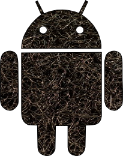

# Velcro

## Bootstrap for your Android Projects.

Get your Android applications off the ground and running quickly with this template. This bootstrap
should contain everything you need to get going but not so much you have to spend time stripping
things out. If you find your self deleting something frequently then it should probably be removed.
This application is highly based off of Jake Wharton's [u2020](https://github.com/JakeWharton/u2020)
and has a debug drawer ready and waiting for more awesomeness.

## Getting started

Requirements: Lazybones 0.7+

Install [lazybones](https://github.com/pledbrook/lazybones) using [gvm](//gvmtool.net/),
[jenv](//jenv.io/) or from [lazybones bintray](https://bintray.com/pledbrook/lazybones-templates/lazybones/view)

Edit/create `~/.lazybones/config.groovy` and add the following.

    bintrayRepositories = [
      "pieces/lazybones-templates",
      "pledbrook/lazybones-templates"
    ]

Run `lazybones list` to see all the available templates.
Run `lazybones create <template name> <template version> <target directory>` to create a new
Velcro project for example run `lazybones create velcro my-awesome-application`.

## Libraries Included

Before diving in and using this project I suggest you check out and understand these libraries. Most
of them will do work for you automatically when you use the BaseActivity or BaseFragment.

* [Dagger](https://github.com/square/dagger) Dependency Injection
* [Butter Knife](https://github.com/JakeWharton/butterknife) View Injection
* [Icepick](https://github.com/frankiesardo/icepick) Save and Restore State
* [Android Preferences](https://github.com/InkApplications/android-preferences) Better Shared Preferences
* [Timber](https://github.com/JakeWharton/timber) Better Android Logger
* [Madge](https://github.com/JakeWharton/madge) Asset Debugging
* [Scalpel](https://github.com/JakeWharton/scalpel) View Debugging

## Contributing

A gradle script has been setup so that all you need to do to add your own code to Velcro is to open
up the velcro-app and work on it like you would any other Android project. Assuming you keep the
same package and application name (Velcro) you should be able to run
`gradlew cleanLazybones copyToLazybones`. This will copy
the files over into their correct location in the archetype project and replace strings with
lazybones variables where required. Then run `gradlew installTemplateVelcro` to install it to your
local lazybones store to try out your changes. This will run an integration test before it
publishes so it should in theory work. Note, you will need lazybones installed for the integration
test to run.

## License

    Copyright 2014 Andrew Reitz

    Licensed under the Apache License, Version 2.0 (the "License");
    you may not use this file except in compliance with the License.
    You may obtain a copy of the License at

        http://www.apache.org/licenses/LICENSE-2.0

    Unless required by applicable law or agreed to in writing, software
    distributed under the License is distributed on an "AS IS" BASIS,
    WITHOUT WARRANTIES OR CONDITIONS OF ANY KIND, either express or implied.
    See the License for the specific language governing permissions and
    limitations under the License.
